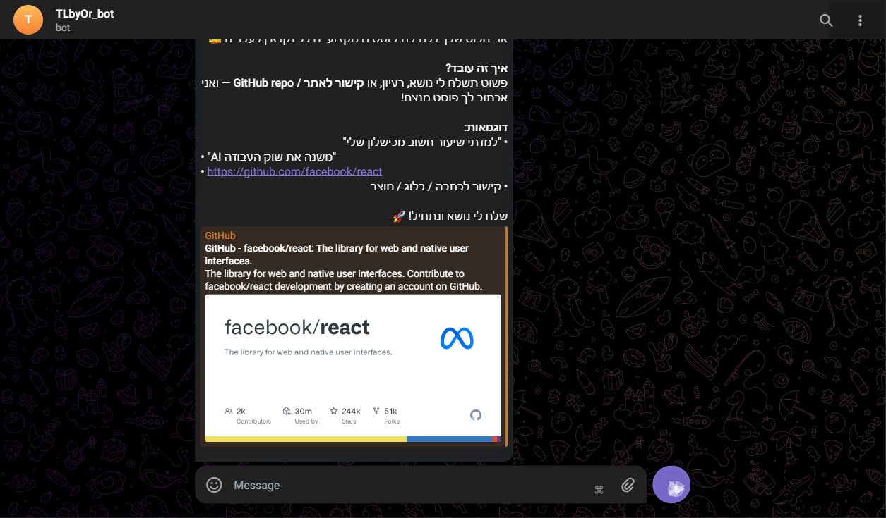

# 🤖 LinkedIn Post Generator Bot

> בוט טלגרם שמייצר פוסטים מקצועיים לינקדאין בעברית בעזרת בינה מלאכותית

[](https://nodejs.org)
[](https://core.telegram.org/bots)
[](https://groq.com)
[](https://opensource.org/licenses/ISC)

---

## ✨ מה הבוט עושה?

הבוט מסייע לאנשי מקצוע ישראלים לכתוב פוסטים ויראליים ומקצועיים ללינקדאין.
פשוט שלחו נושא, כתבת URL של מאמר / אתר / פרויקט GitHub — והבוט יספק פוסט מוכן לפרסום.

---

## 📸 צילומי מסך

### מסך ברוכים הבאים


### בחירת סגנון פוסט


### פוסט מקצועי שנוצר


### פוסט מ-URL של GitHub


### כלי עריכה ושיפור


---

## 🚀 תכונות עיקריות

### 5 סגנונות פוסט
| סגנון | תיאור |
|-------|--------|
| 💼 מקצועי | תוכן עסקי מאוזן ואמין |
| 🌟 השראה | תוכן מניע ומעורר מוטיבציה |
| 📖 סיפור | חוויות אישיות ותובנות |
| 💡 טיפים | רשימת טיפים פרקטיים |
| 🎯 דעה | עמדה נועזת שמעוררת דיון |

### 3 מקורות קלט
- **טקסט חופשי** — שלחו נושא / רעיון ישירות
- **URL כלשהו** — הבוט מנתח את תוכן העמוד ומייצר פוסט
- **GitHub Repo** — הבוט שולף נתוני הפרויקט (כוכבים, פורקים, README) ויוצר פוסט

### כלי עריכה לאחר יצירה
| כפתור | פעולה |
|--------|--------|
| ✂️ קצר | מקצר את הפוסט |
| 📝 הרחב | מרחיב את הפוסט |
| 🔥 חזק את הפתיחה | מחדד את שורת הפתיחה |
| 😄 שחרר | מוסיף קלילות ומשחקיות |
| 💼 מקצועי יותר | מחמיר את הטון |
| 💬 הוראה חופשית | כל הנחיית עריכה בטקסט חופשי |
| 🔄 יצר מחדש | מייצר גרסה חדשה לאותו נושא |
| ✏️ נושא חדש | מתחיל מחדש עם נושא אחר |

---

## 🛠️ טכנולוגיות

| כלי | תיאור |
|-----|--------|
| [Node.js](https://nodejs.org) | סביבת ריצה |
| [Telegraf](https://telegraf.js.org) | ספריית Telegram Bot API |
| [Groq SDK](https://groq.com) | הסקה מהירה עם Llama 3.3 70B |
| [Axios](https://axios-http.com) | HTTP client לגישה לאתרים ו-GitHub API |
| [Cheerio](https://cheerio.js.org) | סריקת HTML וחילוץ תוכן |
| [dotenv](https://github.com/motdotla/dotenv) | ניהול משתני סביבה |

---

## ⚙️ התקנה והפעלה

### דרישות מוקדמות
- Node.js 18 ומעלה
- חשבון [Telegram Bot](https://t.me/BotFather) עם טוקן
- מפתח API של [Groq](https://console.groq.com)

### שלבי התקנה

```bash
# 1. שכפול הפרויקט
git clone https://github.com/YOUR_USERNAME/linkedin-post-bot.git
cd linkedin-post-bot

# 2. התקנת תלויות
npm install

# 3. הגדרת משתני סביבה
cp .env.example .env
# ערכו את קובץ .env עם המפתחות שלכם
```

### הגדרת `.env`

```env
TELEGRAM_BOT_TOKEN=your_telegram_bot_token_here
GROQ_API_KEY=your_groq_api_key_here
```

### הפעלה

```bash
# הפעלה רגילה
npm start

# הפעלה עם hot-reload (פיתוח)
npm run dev
```

---

## 📋 פקודות הבוט

| פקודה | תיאור |
|-------|--------|
| `/start` | הצגת מסך הפתיחה ותפריט הסגנונות |
| `/help` | מדריך שימוש ותכונות |

---

## 🏗️ ארכיטקטורה

```
User (Telegram)
    │
    ▼
[Telegraf Handler]
    │
    ├──► URL? ──► GitHub URL? ──► fetchGithubData() ──► GitHub API
    │                  │
    │                  └──► Webpage URL? ──► fetchWebpage() ──► Cheerio
    │
    └──► Plain text ──► Direct input
    │
    ▼
generateLinkedInPost()
    │
    ▼
Groq API (Llama 3.3 70B)
    │
    ▼
Generated Post + Action Buttons
```

**ניהול מצב:** `userStates` object בזיכרון — שומר לכל משתמש את הטון, הפוסט האחרון, הקלט האחרון וההקשר.

---

## 🔐 אבטחה

- קובץ `.env` **אינו** מועלה ל-Git (כלול ב-`.gitignore`)
- אין שמירת נתוני משתמשים
- כל התקשורת דרך HTTPS

> ⚠️ **לעולם אל תשתפו** את `TELEGRAM_BOT_TOKEN` או `GROQ_API_KEY` שלכם

---

## 📁 מבנה הפרויקט

```
telegramBot/
├── index.js          # כל לוגיקת הבוט
├── package.json      # תלויות ופקודות
├── .env              # מפתחות API (לא בגיט!)
├── .env.example      # תבנית לקובץ .env
├── .gitignore        # קבצים מוחרגים מ-Git
└── README.md         # תיעוד זה
```

---

## 🤝 תרומה לפרויקט

Pull Requests מוזמנים! לפני שתפתחו PR:

1. עשו `fork` לפרויקט
2. צרו branch חדש: `git checkout -b feature/amazing-feature`
3. Commit: `git commit -m 'Add amazing feature'`
4. Push: `git push origin feature/amazing-feature`
5. פתחו Pull Request

---

## 📄 רישיון

ISC License — ראו [LICENSE](LICENSE) לפרטים נוספים.

---

<div align="center">
נבנה עם ❤️ בעברית, לשוק הישראלי
</div>
